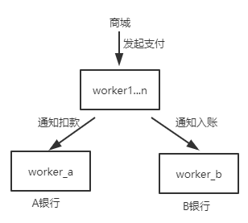
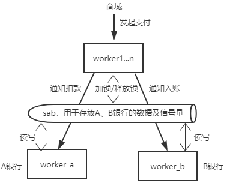

# 订单支付

比如用户在某商城对一个订单进行了支付，此时会对用户的银行卡进行扣款，接着商家也会收到一笔账。虽然这个例子永远不可能发生在 JavaScript 的世界当中，但还是能借助这个例子说明下共享内存和消息通信两个版本的区别。另外，我们对这个例子的实现添加一些说明：

+ 假设用户和商家用的不是一家银行
+ 银行对外提供了查询余额的接口
+ 商家与银行的业务逻辑需要分离
+ 可同时发起多笔支付

## 基于消息通信

设计如下：

其中A、B银行的业务逻辑和数据都在自己 worker 中，那么在支付行为发生时，会分别给A、B银行发送通知进行扣款或者入账，这就可能会导致某一时刻下，查询用户与商家的余额，出现了不一致的现象。因为可能A银行对用户扣款成功了，但B银行还未完成入账。这种场景下，再怎么优化，也只能保证数据的最终一致性。

## 基于共享内存

设计如下：

1. 支付时（假设在 worker1），先对相应的数据进行加锁
2. 通知A、B银行扣款/入账（可以用信号量进行同步），并在操作成功后通知 worker1
3. worker1 收到A银行和B银行的通知后就释放掉锁

同时，在读取银行余额的接口中，判断当前是否有其他任务正在写入数据，有的话则挂起等待，没有的话直接读取，这样一来就能保证数据的强一致性了。
